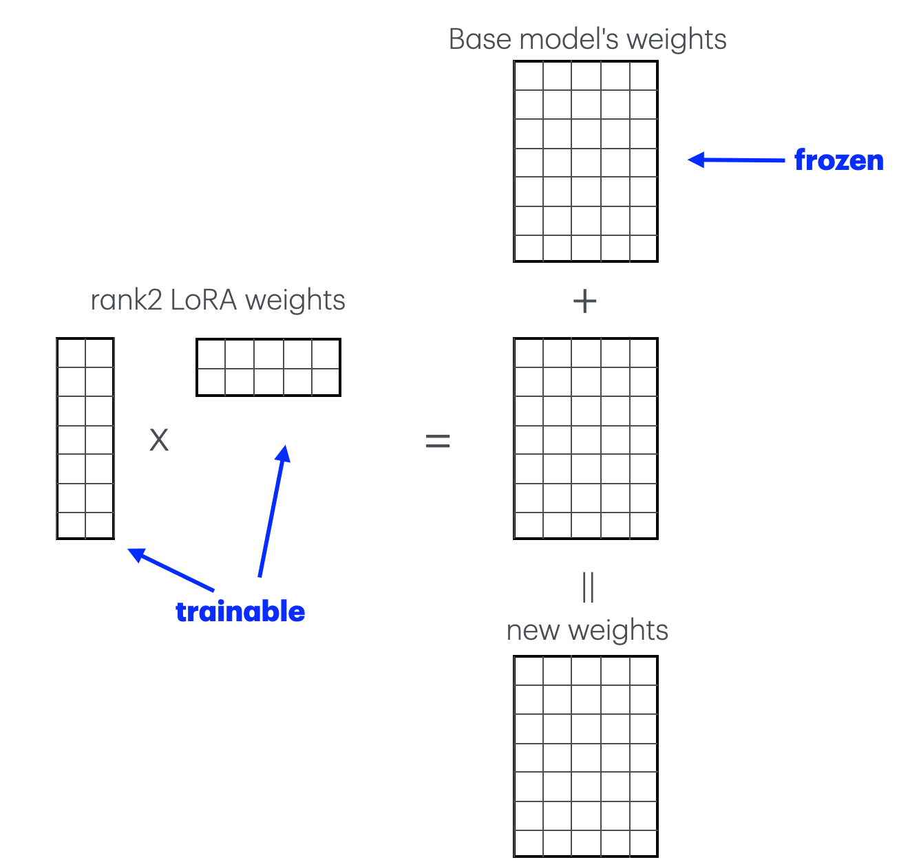
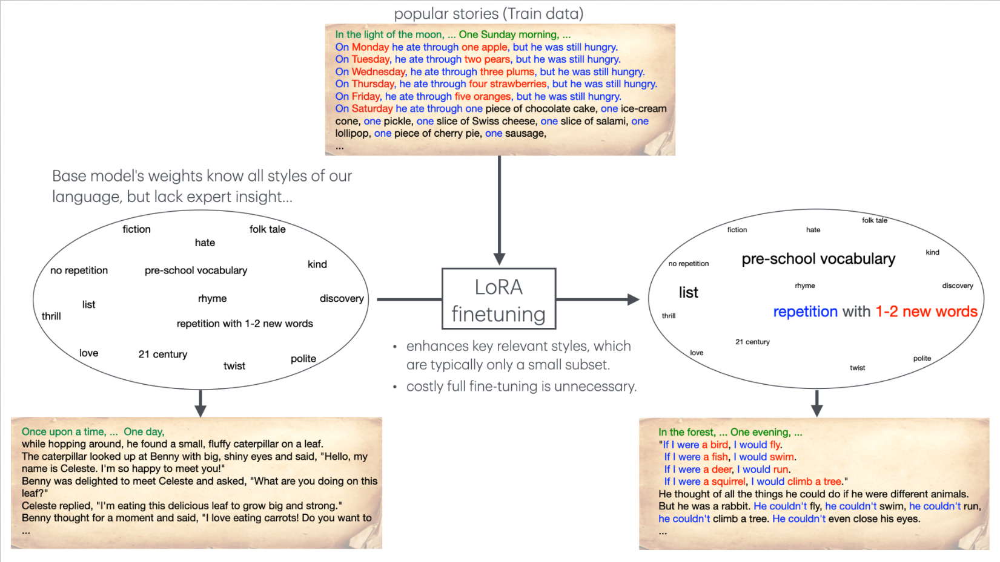

# Low-Rank Adaptation (LoRA) of Large Language Models (LLMs)
This [notebook](./QLoRA_with_Unsloth.ipynb) provides an example of how to finetune LLMs using LoRA. Here, we will apply LoRA so that a model (Meta Llama 3.1 8B Instruct) generates stories appropriate for one- to three-year-old children.

LoRA is a [Parameter-Efficient Fine-Tuning](https://huggingface.co/docs/peft/en/index) method that is very effective. It requires very little computational resources. Therefore, you can train an LLM using a free T4 GPU on Google Colab or even with your personal computer if it has a GPU. In this method, the original model's weights are unchanged, and only a small amount of trainable weights are introduced to form low-rank tensors, which are added to the original weights as shown below:     

When you want to introduce more trainable weights, you just need to increase the LoRA rank like this:

As you increase the LoRA rank, the finetuning becomes closer to full finetuning.  

You can also control which part of the original LLM components you want to apply LoRA.

See the seminal paper [LoRA: Low-Rank Adaptation of Large Language Models](https://arxiv.org/abs/2106.09685) by Hu et al.

In this tutorial, we will have the LLM generate stories appropriate for one- to three-year-old children. Without LoRA, the original LLM generates stories in a folk-tale style. However, this style is not really popular among this age group nowadays. Therefore, using LoRA, we will train the LLM so that it generates stories in a more popular style having repetitions with some variations at each repetition and with more limited vocabulary appropriate for this age group, as shown below:

Roughly speaking, the original LLM knows all styles of our language, but it lacks expert insight. LoRA can enhance key relevant styles, which are typically only a small subset of our full language styles. Using LoRA, we can avoid the costly full finetuning!

